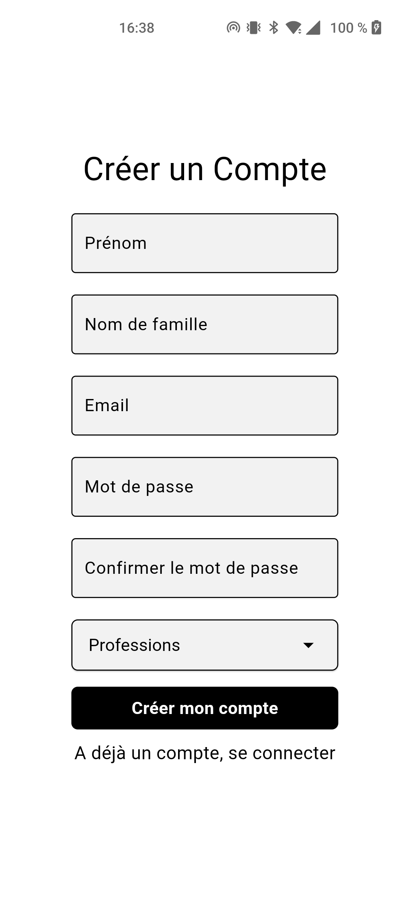
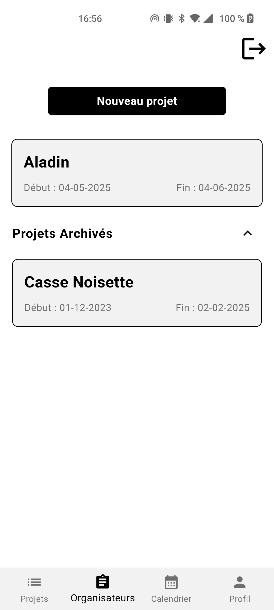

# Manuel d'utilisation

## Table des matière
1. [Créer un compte](#créer-un-compte)
2. [Créer un projet](#créer-un-projet)
3. [Modifier un projet](#modifier-un-projet)
    1. [Modifier les informations de base du projet](#modifier-les-informations-de-base-du-projet)
    2. [Modifier les participants au projet](#modifier-les-participants-au-projet)
    3. [Modifier les répétitions du projet](#modifier-les-répétitions-du-projet)
4. [Accéder au projet archiver](#accéder-au-projet-archiver)

## Créer un compte
Si vous êtes sur l'écran d'accueil de l'application, vous pouvez créer un compte en cliquant sur le texte "Créer un compte".

Cela vous redirigera vers la page dédiée pour entrer les informations nécessaires à la création du compte, comme montré sur la capture d’écran ci-dessous :

## Créer un projet
Pour créer un projet, il faut sélectionner l'onglet "Organisateurs" dans la barre de navigation, puis cliquer sur le bouton "Nouveau projet".

Lors de la création du projet, vous devrez renseigner plusieurs informations, dont un nom, une date de début, une date de fin, et une description (facultative).

Une fois le projet créé, il apparaîtra dans la liste des projets en dessous du bouton "Nouveau projet".

## Modifier un projet
Pour modifier un projet, cliquez sur le projet désiré dans la liste des projets, sous l'onglet "Organisateurs". Cela vous amènera à une page vous permettant de modifier :
1. Les informations enregistrées lors de la création du projet (nom, description et dates),
2. Les participants liés au projet,
3. Les répétitions liées au projet.

### Modifier les informations de base du projet
### Modifier les participants au projet
### Modifier les répétitions du projet

## Accéder au projet archiver
Les projets dont la date de fin est passée sont placés dans les projets archivés. Ils peuvent être retrouvés dans l'onglet "Projets archivés", situé en dessous de la liste des projets actifs.

 

