# Manuel d'utilisation

Ci-dessous, vous trouverez le manuel d'utilisation de l'application.
\
Cette application est destinée à améliorer l'organisation des répétitions de spectacles en permettant de générer automatiquement un calendrier de répétitions, basé sur les disponibilités de chacun, et les besoins spécifiques de chaque répétition (durée, ordre, etc.).
\
Les participants auront accès à toutes les informations nécessaires concernant le projet, ainsi qu'à un calendrier regroupant l'ensemble de leurs répétitions.

## Table des matière
1. [Créer un compte](#créer-un-compte)
2. [S'identifier](#sidentifier)
3. [Accéder au profil](#accéder-au-profil)
4. [Modifier les informations de votre profil](#modifier-les-informations-de-votre-profil)
5. [Gérer vos disponibilités](#gérer-vos-disponibilités)
    1. [Ajouter une disponibilité dans votre semaine type](#ajouter-une-disponibilité-dans-votre-semaine-type)
    2. [Ajouter une période de non-disponibilité](#ajouter-une-période-de-non-disponibilité)
6. [Se déconnecter](#se-déconnecter)
7. [Créer un projet](#créer-un-projet)
8. [Modifier un projet](#modifier-un-projet)
    1. [Modifier les informations de base du projet](#modifier-les-informations-de-base-du-projet)
    2. [Gérer les participants du projet](#gérer-les-participants-du-projet)
        1. [Ajouter un participant](#ajouter-un-participant)
        2. [Modifier les rôles d'un participant](#modifier-les-rôles-dun-participant)
        3. [Supprimer un utilisateur de la liste des participant au projet](#supprimer-un-utilisateur-de-la-liste-des-participant-au-projet)
    3. [Gérer les répétitions du projet](#gérer-les-répétitions-du-projet)
        1. [Ajouter une répétition](#ajouter-une-répétition)
        2. [Modifier les informations d'une répétition](#modifier-les-informations-dune-répétition)
        3. [Supprimer une répétition](#supprimer-une-répétition)
        4. [Ajouter un ordre entre les répétitions](#ajouter-un-ordre-entre-les-répétitions)
9. [Accéder aux présences](#accéder-aux-présences)
10. [Supprimer un projet](#supprimer-un-projet)
11. [Calculer l'horaire des répétitions](#calculer-lhoraire-des-répétitions)
12. [Accéder à la liste des projets dont vous êtes organisateur](#accéder-à-la-liste-des-projets-dont-vous-êtes-organisateur)
13. [Accéder à la liste des projets auxquels vous participez](#accéder-à-la-liste-des-projets-auxquels-vous-participez)
14. [Accéder au projet archivés](#accéder-au-projet-archivés)

## Créer un compte
Si vous êtes sur l'écran d'accueil de l'application, vous pouvez créer un compte en cliquant sur le texte "Créer un compte".

Cela vous redirigera vers la page dédiée pour entrer les informations nécessaires à la création du compte, comme montré sur la capture d’écran ci-dessous :

## S'identifier
L’écran d’accueil de l’application vous permet de vous identifier avec votre adresse email et votre mot de passe.

Si vous avez oublié votre mot de passe, appuyez sur "Mot de passe oublié ?" et entrez votre adresse email.
Un email de réinitialisation vous sera envoyé, à condition qu’un compte existe avec cette adresse email.

## Accéder au profil
Pour accéder à votre profil, sélectionnez l’onglet "Profil" dans la barre de navigation.

## Modifier les informations de votre profil
Sur la page du profil, appuyez sur "Modifier" pour modifier vos informations personnelles.

 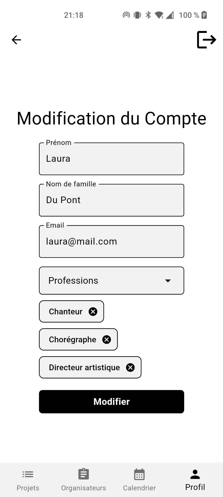

## Gérer vos disponibilités
Les disponibilités se définissent de deux façons :
 - En ajoutant des créneaux disponibles sur une semaine type,
 - En indiquant des périodes d’indisponibilité.

Pour accéder à la page de gestion des disponibilités, allez dans votre profil et appuyez sur "Gérer mes disponibilités".

### Ajouter une disponibilité dans votre semaine type
Une fois sur la page, appuyez sur "Ajouter une disponibilité".
Vous pourrez ensuite définir une heure de début et une heure de fin, ainsi que sélectionner les jours de la semaine où cette disponibilité s’applique.

Pour supprimer un créneau, appuyez sur la croix située à droite du créneau.

 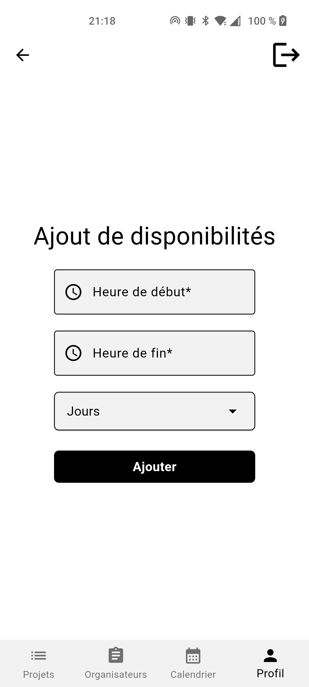

### Ajouter une période de non-disponibilité
Pour ajouter une période d’indisponibilité, appuyez sur "Ajouter des vacances".

Vous pouvez supprimer une période en appuyant sur la croix à côté de la période que vous souhaitez retirer.

 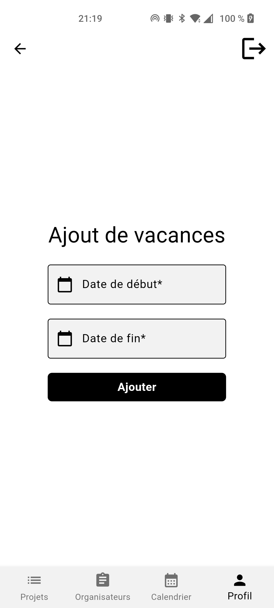

## Se déconnecter
Pour vous déconnecter, appuyez sur l’icône de déconnexion située en haut à droite de l’écran (visible sur toutes les pages de l’application).

## Créer un projet
Pour créer un nouveau projet :
1. Sélectionnez l’onglet "Organisateurs" dans la barre de navigation.
2. Appuyer sur le bouton "Nouveau projet".

Lors de la création du projet, vous devrez renseigner plusieurs informations, dont un nom, une date de début, une date de fin, et une description (facultative).

(3.) Une fois le projet créé, il apparaîtra dans la liste des projets en dessous du bouton "Nouveau projet".

## Modifier un projet
Vous pouvez modifier un projet seulement si vous avez le rôle d'organisateur sur ce projet.

Pour accéder à la page de modification d’un projet :
1. Appuyer sur l’onglet "Organisateurs".
2. Appuyer sur le projet désiré dans la liste des projets.

 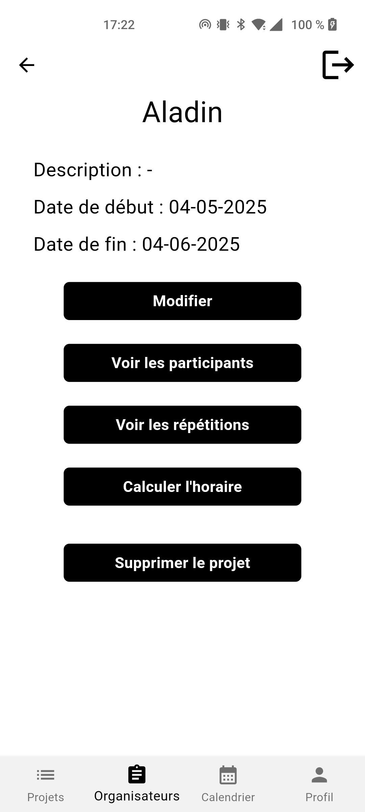

Depuis cette page, vous pouvez modifier :
- Les informations enregistrées lors de la création du projet (nom, description et dates),
- Les participants liés au projet,
- Les répétitions liées au projet.

### Modifier les informations de base du projet
Pour modifier les informations fournis lors de la création du projet il vous suffiras d'appuyer sur le bouton "Modifier".

 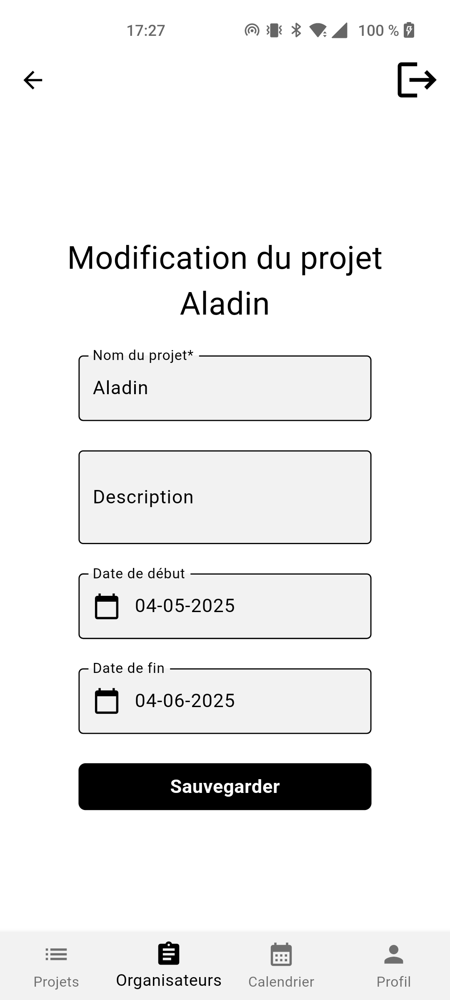

### Gérer les participants du projet
Pour modifier la liste des participants du projet, appuyer sur le bouton "Voir les participants".

 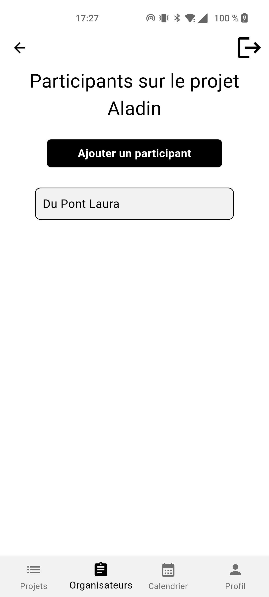

Depuis cette page, vous pouvez :
- Ajouter des participants,
- Modifier les rôles des participants,
- Supprimer des participants.

#### Ajouter un participant
Pour ajouter un participant, appuyer sur le buton "Ajouter un participant".
L'ajout se fait sur base de l'adresse email de l'utilisateur que vous souhaitez ajouter.

 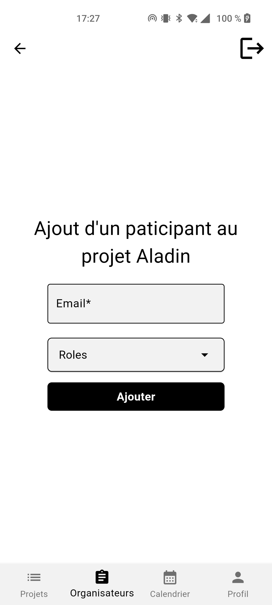

#### Modifier les rôles d'un participant
Pour modifier le rôle d’un participant :
1. Sélectionnez le participant concerné dans la liste,
2. Appuyer sur le buton "Modifier les rôles".
\
Vous pouvez également supprimer un rôle en cliquant sur la croix située à côté du rôle.

  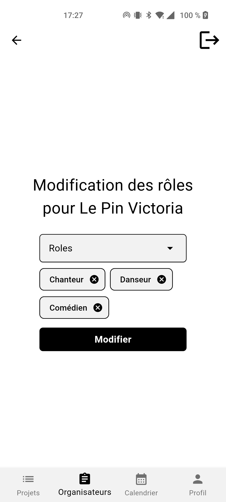

#### Supprimer un utilisateur de la liste des participant au projet
Pour supprimer un participant :
1. Sélectionnez-le dans la liste,
2. Appuyer sur le buton "Supprimer le participant".

 

### Gérer les répétitions du projet
Pour modifier les informations liées aux répétitions, appuyer sur le bouton "Voir les répétitions".

 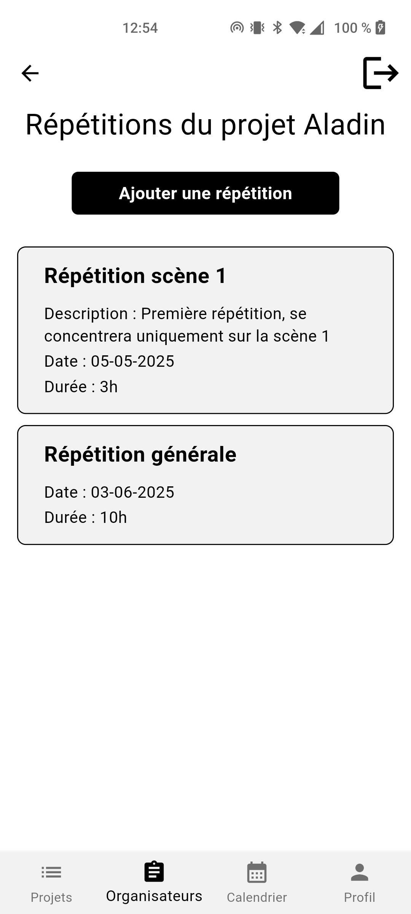

### Ajouter une répétition
Pour ajouter une répétition, appuyer sur le bouton "Ajouter une répétition".

 

### Modifier les informations d'une répétition

Pour modifier les informations concernant une répétition:
1. Sélectionnez la répétition concernée dans la liste,
2. Appuyer sur le bouton "Modifier".

 

### Supprimer une répétition
Pour supprimer une répétition :
1. Sélectionnez la répétition concernée dans la liste,
2. Appuyer sur le bouton "Supprimer la répétition".

 

### Ajouter un ordre entre les répétitions
Pour définir un ordre de précédence entre les répétitions :
1. Sélectionnez la répétition qui doit suivre dans l’ordre,
2. Appuyez sur le bouton "Ordre des répétitions",
3. Appuyer ensuite sur "Ajouter une précédence",
4. Sélectionnez la ou les répétitions qui doivent précéder celle-ci.

   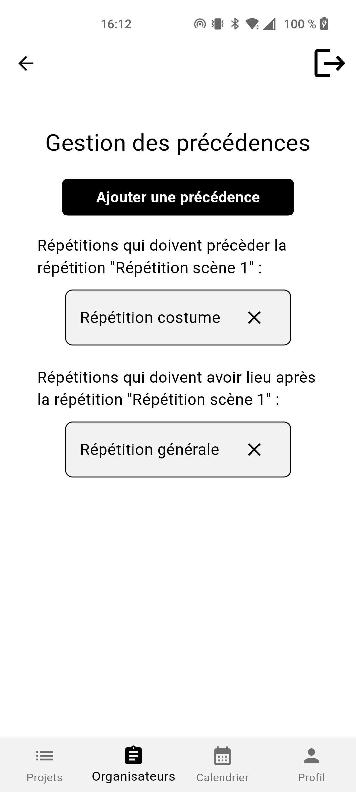

## Accéder aux présences
Vous pouvez accéder aux présences d’une répétition uniquement si vous avez le rôle d’organisateur sur le projet auquel la répétition appartient.

Lorsqu’une répétition a une date et une heure définies, il est possible de consulter les disponibilités des participants.
Pour cela :
1. Sélectionnez la répétition concernée dans la liste,
2. Appuyez sur le bouton "Afficher les présences".

 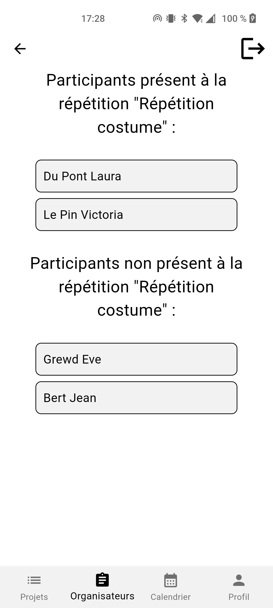

## Supprimer un projet
La suppression d’un projet est uniquement possible si vous avez le rôle d’organisateur sur ce projet.

Pour supprimer un projet :
1. Appuyez sur l’onglet "Organisateurs",
2. Sélectionnez le projet dans la liste,
3. Appuyez sur le bouton "Supprimer le projet".

 

## Calculer l'horaire des répétitions
Le calcul de l’horaire des répétitions est uniquement possible si vous avez le rôle d’organisateur sur le projet.

Pour lancer le calcul de l’horaire :
1. Appuyez sur l’onglet "Organisateurs",
2. Sélectionnez le projet dans la liste,
3. Appuyez sur le bouton "Calculer l'horaire".

Vous verrez alors une proposition d’horaire s’afficher.

L’horaire généré respectera les contraintes définies (ordre des répétitions, durée, etc.) tout en maximisant le taux de présence des participants aux répétitions.

Les créneaux en vert indiquent les répétitions considérées comme acceptées.
Dans le cas d’un premier calcul, cela correspond aux répétitions qui avaient déjà une date et une heure définies. Et les créneaux en rouge indiquent les répétitions considérées comme pas encore acceptées.

Vous pouvez modifier manuellement le statut des créneaux en appuyant sur leur icône :
 - Si un créneau affiche une croix (✕), cela signifie qu’il est actuellement non accepté. 
 \
 En appuyant dessus, il passera à l’état accepté (✓).
 - Si un créneau affiche un ✓, cela signifie qu’il est accepté. 
 \
 En appuyant dessus, il repassera à l’état non accepté (✕).

Si aucun horaire ne convient pas, vous pouvez appuyer sur "Recalculer". Les créneaux déjà approuvés conserveront leur valeur. Et les autres seront changer.

Une fois que l’horaire vous convient, appuyez sur "Tout valider".
Cela fixera la date et l’heure de chaque répétition concernée.
Ces horaires seront ensuite visibles dans le calendrier des participants.

Sur chaque créneau proposé, une fraction indique la proportion de participants disponibles. En appuyant dessus, vous pouvez voir la liste détaillée des personnes disponibles ou non pour ce créneau.

  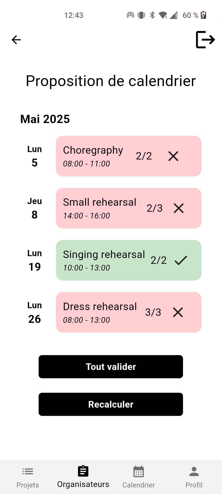

## Accéder à la liste des projets dont vous êtes organisateur
Pour voir la liste des projets sur lesquels vous êtes organisateur, appuyez sur l’onglet "Organisateurs".
Les projets affichés dans cette section sont ceux sur lesquels vous avez un rôle d’organisation.

## Accéder à la liste des projets auxquels vous participez
Pour consulter les projets auxquels vous participez (sans nécessairement être organisateur), appuyez sur l’onglet "Projets".

## Accéder au projet archivés
Les projets dont la date de fin est passée sont placés dans les projets archivés. Ils peuvent être retrouvés dans l'onglet "Projets archivés", situé en dessous de la liste des projets actifs.

 

